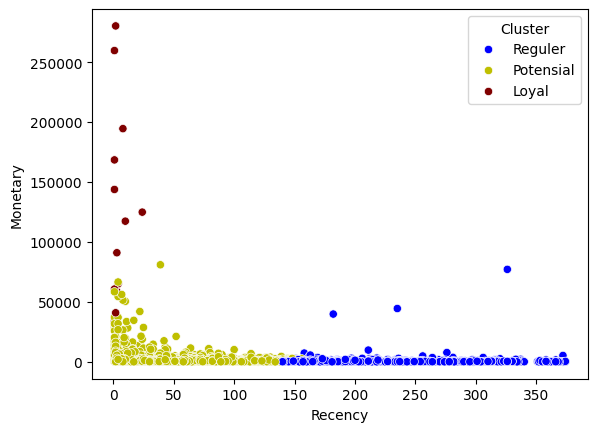
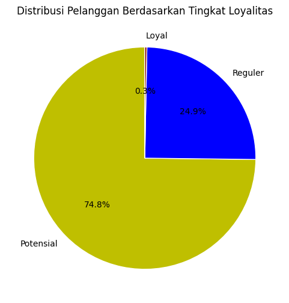

# customer-segmentation-rfm
Menggunakan K-means Clustering untuk membuat klasifikasi costumer bedasarkan Retency (Berapa lama pembelian terakhir customer dari hari ini), Frekuensi (seberapa sering customer berbelanja), dan Monetery (Jumlah keseluruhan uang yang dibelanjakan costumer)
## 📊 Dataset
Online Retail Dataset ([UCI Machine Learning Repository](https://archive.ics.uci.edu/ml/datasets/online+retail))

## 🧠 Key Insights
- 0.3% customers are Loyal (high frequency, low recency, high monetery)
- 74.8% customer are potensial (medium frequency, medium recency, medium monetery)
- 24.9 customer are reguler (low frequency, high recency, low monetery)

## 🎯 Strategy Recommendations
### 🟢 Loyal Customers (0.3%)
- Maintain engagement through loyalty programs and exclusive rewards  
- Offer premium services or early access to new products  
- Encourage advocacy via referral or membership programs  

### 🟡 Potential Customers (74.8%)
- Provide personalized discounts and promotions  
- Utilize targeted email or digital marketing campaigns  
- Strengthen customer relationships to increase repeat purchases  

### 🔵 Regular / At-Risk Customers (24.9%)
- Launch re-engagement campaigns (*“We miss you”* offers)  
- Send feedback surveys to understand inactivity reasons  
- Offer limited-time discounts to reactivate interest  

---

## ⚙️ Technical Overview

- **Algorithm:** K-Means Clustering  
- **Preprocessing:** Data scaled using `StandardScaler()`  
- **Features:** Recency, Frequency, Monetary  
- **Visualization:** Matplotlib & Seaborn (2D scatter and pie charts)  
- **Evaluation Metric:** Inertia (Elbow Method)

---

## 📈 Visualizations

### 🟢 Customer Segmentation Scatter Plot
Visualizing customer clusters based on Recency and Monetary value.

---

### 🟣 Cluster Distribution Pie Chart
Shows the proportion of customers in each segment.

---

## 🧠 Interpretation

This segmentation helps the business:
- Identify **high-value (loyal)** customers to retain  
- Target **potential** customers for growth  
- Re-engage **inactive** customers to prevent churn  

## 🛠️ Tools
Python, Pandas, Scikit-learn, Seaborn, Matplotlib
